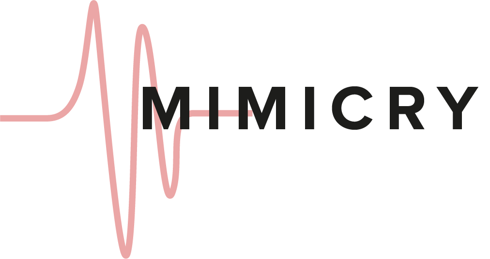

	

<h3 align="center">Language learning with voice controlled cloze cards (WIP)</h3>

<h4 align="center">
<a href="#overview">Overview</a> • <a href="#demo">Demo</a> • <a href="#built-with">Built With</a> • <a href="#todos">Todos</a>
</h4>

  

<h2 id="overview">Overview</h2>

A language-learning web application based on voice-controlled cloze cards. It aims to help users learn new words and develop confidence and muscle memory in speaking their target languages.

_Work in progress_

<h2 id="demo">Demo</h2>

[__Live Demo__](https://calvincheng.github.io/Mimicry) (Note: Only supported on Google Chrome)

<h2 id="built-with">Built With</h2>

* [Firebase Authentication](https://firebase.google.com/docs/auth)
* [Firebase Realtime Database](https://firebase.google.com/docs/database)
* [WebSpeech API](https://developer.mozilla.org/en-US/docs/Web/API/Web_Speech_API)
* [Material Design](https://material.io/design)

<h2 id="todos">Todos</h2>

* Email verification
* Add more cards
* More intuitive user recording
* Cloze inputs
* User profile actions
* List of seen cards
* Replace WebSpeech with Google Cloud Speech-To-Text (if $$$ allows)
